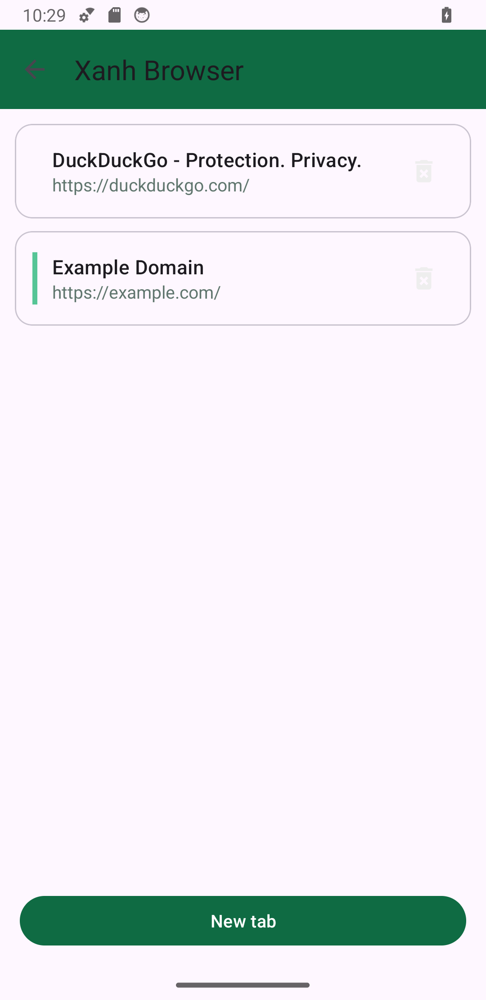

<p align="center">
  
</p>

<h1 align="center">Xanh Browser for Android</h1>

Xanh Browser is the privacy-first, full multi-tab Android edition of the Xanh
Browser family. It combines the serviced system WebView with native Android UI
components, so the application stays small and receives browser-engine updates
through the installed WebView provider.

> **Release status:** 1.0.0 is a release candidate. Local build, unit-test and
> lint lanes pass, while production remains blocked until the signed-artifact,
> emulator/device, security-scan and Play gates in
> [RELEASING.md](RELEASING.md) are complete.

## App preview

<p align="center">
  
  
</p>

<p align="center"><em>The current native Android build showing browsing and tab management.</em></p>

These are direct captures from the application, not product mockups. They use a
clean emulator profile and a neutral documentation page, with no personal
browsing data.

## Application identity

| Property | Value |
| --- | --- |
| Display name | Xanh Browser |
| Application ID | `io.github.lamppkk.xanhbrowser` |
| Version | 1.0.0 (`10000`) |
| Minimum Android | 8.0 / API 26 |
| Compile SDK | Android SDK Platform 37.1 |
| Target SDK | API 36 |
| Java runtime | JDK 17 |
| Build system | Android Gradle Plugin 9.3.2, Gradle 9.7.1, built-in Kotlin |
| WebView compatibility layer | AndroidX WebKit 1.17.0 stable |

## Xanh WebView migration

The application now constructs the Xanh-owned `XanhWebView` boundary instead
of instantiating the provider widget directly. Its current backend is still the
serviced Android System WebView and is reported explicitly as a fallback. The
replacement target is the source-built
[`LamPPKK/wpe-android`](https://github.com/LamPPKK/wpe-android) backend exposed
by the common [`Xanh WebView`](https://github.com/LamPPKK/xanh-webview) SDK.

This is an application-level embedding API, not an Android system WebView
provider. The full API-26 app will switch only after WPE passes multi-profile,
downloads, permissions, renderer recovery, accessibility, credential bridge,
content-blocking, 16 KiB and device-matrix gates. Until then, the serviced
provider remains the production fallback rather than silently reducing
security or supported devices.

This is a new application ID. Installation starts with an empty profile and
does not import data from the legacy Android application.

The scheduled AndroidX WebKit baseline workflow reads official Google Maven
metadata weekly and fails if a shipping Gradle pin or its strict AAR/module
checksums lag the newest stable release. Alpha, beta, RC and dynamic pins are
rejected rather than treated as production updates.

The separate Android build-tool baseline checks official Google Maven and
Gradle release metadata weekly. It fails if the stable AGP/Gradle pins, Gradle
distribution checksum or checked-in wrapper JAR no longer match upstream.

AndroidX Core is pinned to stable 1.19.0. Its published AAR requires compile
API 37, so every module builds against stable Android SDK Platform 37.1 while
the shipping application continues to target API 36.

The production UI/tooling stack uses stable Activity 1.13.0, Annotation 1.10.0,
AppCompat 1.8.0, Browser 1.10.0, Material Components 1.14.0 and KSP 2.3.11.
A dedicated weekly baseline reads official Google Maven and Maven Central
metadata for those coordinates plus Core, Lifecycle, Biometric, RecyclerView,
Room, WorkManager, AndroidX Test and JUnit. It rejects prerelease/dynamic or
inconsistent Gradle pins and requires strict SHA-256 entries for every selected
artifact. WebKit, AGP/Gradle and Mozilla Application Services remain covered by
their dedicated engine/toolchain baselines. The Android Application Services
gate resolves Mozilla's official stable tags, then binds the five direct AARs,
the checked-in lock/revision, notice and strict AAR/POM checksums together; it
also requires fail-closed exclusive resolution from Mozilla's official Maven
repository and does not trust the legacy per-artifact Maven metadata as a
release oracle.

## Current capabilities

- Independent multi-tab browsing with safe process-death restoration
- Room-backed history, bookmarks and download records with a versioned schema;
  its schema-v2 compatibility mirror preserves exact Places bookmark GUIDs and
  visit timestamps for mutation
- Browser library for browsing and managing saved data
- Phone, tablet and foldable layouts using XML Views and View Binding
- Back/forward navigation, predictive back, sharing and desktop mode
- Downloads through Android DownloadManager and scoped storage
- File upload and per-origin geolocation consent through Activity Result APIs
- Checked external-scheme handoff for supported main-frame user actions
- Ad and tracker blocking, enabled by default for regular and private tabs,
  backed by the shared Rust core in production
- Asynchronous privacy clearing and bounded, foreground-only WebView
  render-process recovery with exact dead-view teardown
- Password-encrypted portable backup for regular tabs, compatible with the
  Lite, Android WebKit preview and Windows editions
- Optional Mozilla Accounts / Firefox Sync for bookmarks, history, remote tabs
  and an authenticated, Xanh-only password vault
- Private browsing in a random AndroidX WebKit profile isolated from the
  regular profile, Room, Sync, credential filling and portable backup

## Security and privacy defaults

- Safe Browsing is enabled when supported by the installed System WebView.
- Production cleartext traffic and mixed content are blocked.
- Only valid HTTP(S) addresses with a host are loaded in the WebView.
- External schemes are resolved before launch; unsupported intents remain closed.
- File and geolocation access require user action and can be cancelled safely.
- Legacy external-storage permissions are not requested.
- Private upload keys and passwords are accepted only through environment or
  private Gradle properties and must never enter Git.
- Portable backups use PBKDF2-HMAC-SHA256 and AES-256-GCM, reject unsafe URLs
  and never contain cookies, passwords, cache or private browsing state.
- Private browsing is offered only when the installed System WebView exposes
  AndroidX `MULTI_PROFILE`; unsupported providers fail closed instead of using
  the regular cookie/storage profile. Private URLs are never written to Room,
  Xanh opts the private hierarchy out of Android Autofill/content capture and
  requests no IME personalized learning; OS provider/IME compliance remains
  platform-controlled. Its network user agent is identical to regular browsing. The
  provider is asked to delete the ephemeral profile after its Activity is
  destroyed. Providers that keep a used profile resident leave its random name
  quarantined; Xanh deletes every such stale profile at the next cold process
  start, before creating a WebView. Explicitly downloaded files remain on the
  device after the private session closes. Renderer recovery is foreground-only
  and stops after one automatic attempt. A private download is retained only
  after native confirmation; both the file and its system DownloadManager record
  can remain.

JavaScript is enabled because modern websites require it. The WebView boundary,
URI validation and permission checks are therefore part of the release security
review.

## Ad and tracker blocking

Production artifacts package `xanh-adblock-core` and call its stable C ABI from
Kotlin through the direct JNA 5.18.1 dependency. The core embeds Brave
`adblock-rust` 0.13.3; Android accepts only the exact Xanh core ABI
`1.0.0-alpha.1`. Blocking is on by default and can be changed from either the
regular or private browser menu.

The same process-wide matcher covers subresource requests from regular and
private WebViews. Xanh also installs a `ServiceWorkerClient` for the default
WebView profile and, when `MULTI_PROFILE` is available, for the isolated private
profile. Main-frame navigation is deliberately never blocked here; it remains
under the browser's existing navigation and external-scheme policy.

If the native library is unavailable, rejects an input or fails a call, Xanh
uses a bounded seven-rule domain fallback. That fallback is Xanh-owned bootstrap
data, not EasyList, and is intentionally much smaller than the Rust engine.
Production release packaging therefore requires the reviewed native artifact;
ordinary local builds without it exercise the fallback path only.

This integration is not a claim of uBlock Origin feature parity. Android
WebView does not expose every browser-extension interception primitive or all
request metadata. Resource-type inference, redirect coverage, and third-party
classification for service-worker requests are best-effort. `blob:` and
`javascript:` URLs are outside the HTTP(S) network matcher.

## Prerequisites

- JDK 17
- Android SDK Platform 37.1 and Build Tools 36.1.0
- An API 26+ device or emulator for instrumentation tests
- For production adblock packaging: Rust 1.97.1, Android NDK 29.0.14206865 and
  the `midori-core` revision pinned by `ADBLOCK_CORE.lock`

The Gradle wrapper downloads Gradle 9.7.1. Use the wrapper rather than a global
Gradle installation.

## Build and test

Run the same local pipeline used by the primary CI workflow:

```sh
./gradlew --no-daemon \
  :backup-core:testDebugUnitTest \
  :app:lintDebug \
  :app:testDebugUnitTest \
  :app:assembleDebug \
  :app:assembleAndroidTest \
  :app:bundleRelease
```

Run connected instrumentation tests with a device or emulator available:

```sh
./gradlew --no-daemon :app:connectedDebugAndroidTest
```

Important outputs:

| Artifact | Path | Purpose |
| --- | --- | --- |
| Debug APK | `app/build/outputs/apk/debug/app-debug.apk` | Local installation |
| Instrumentation APK | `app/build/outputs/apk/androidTest/debug/app-debug-androidTest.apk` | Device tests |
| Release AAB | `app/build/outputs/bundle/release/app-release.aab` | Unsigned verification only |
| Lint report | `app/build/reports/lint-results-debug.html` | Static-analysis review |

`bundleRelease` does not produce a Play-uploadable artifact without signing
configuration. Follow [RELEASING.md](RELEASING.md) and use the guarded
`bundleProductionRelease` task for production. That task also requires
`XANH_ADBLOCK_NATIVE_DIR` (or `-PxanhAdblockNativeDir`) to point to a verified
package containing exactly `arm64-v8a`, `armeabi-v7a` and `x86_64` builds of
`libxanh_adblock_core.so`.

## Encrypted backup and provider sync

Use **Export encrypted backup** and **Import encrypted backup** in the browser
menu. The operating-system Documents picker can write the `.xanhbackup` file
directly to Google Drive or another installed provider. The same encrypted
snapshot can be stored in an OS-backed-up folder or a Git working tree without
giving Xanh Browser any cloud or Git credential.

The full Android edition exports up to 50 regular open tabs and restores them
as new tabs. Cookies, passwords, form data, cache, downloads and private state
are excluded. See [`docs/PORTABLE_BACKUP.md`](docs/PORTABLE_BACKUP.md) for the
wire format and conflict rules.

## Android WebKit preview

The separately installable WPE WebKit experiment is intentionally the Lite
one-tab edition in the
[core repository](https://github.com/LamPPKK/midori-core/tree/main/app-webkit).
The full multi-tab app remains on serviced Android System WebView until WPEView
exposes the navigation, permission, download and 16 KiB-native-library baseline
required by the full browser. The preview uses its own application ID and
cannot silently replace this production edition.

## Mozilla Accounts / Firefox Sync

The `sync-core` module consumes the official Mozilla Application Services
155.0 AARs and provides OAuth PKCE, Places/Tabs/Logins engines, WorkManager
scheduling, encrypted account state and the native credential boundary. It can
use an approved Mozilla-hosted client or an HTTPS self-hosted deployment. See
[`docs/FIREFOX_SYNC.md`](docs/FIREFOX_SYNC.md) for the implementation snapshot,
data migration, security and release requirements. Local build success does
not open the production gate: live Firefox interoperability, signed artifacts,
the device matrix and security review remain required. Account tokens, scoped
keys and passwords are never part of `.xanhbackup`. Because Application
Services engine registration is process-wide, Android also enforces one live
Sync runtime per process to prevent cross-profile engine resolution. Password
suggestions require a recent trusted user gesture and an unlocked vault; the
runtime returns only bounded form credentials matching the exact canonical
HTTPS origin. The Xanh-only password library applies the same origin,
identifier and UTF-8 byte limits to list/add/update/delete/touch operations,
marks successful local mutations for Sync, and drops decrypted rows/dialogs
whenever its Activity leaves the foreground. Its hierarchy opts out of Android
Autofill and content capture and requests no IME personalized learning;
provider/IME compliance remains platform-controlled.

The Room compatibility mirror does not infer Sync identity from URL. Native
bookmarks retain their 12-character Places GUID, duplicate URLs remain separate,
and history retains the exact millisecond visit identity plus its remote flag.
Library rename/delete therefore creates only the selected upstream mutation.
Rows written while Places is unavailable keep an empty identity and synchronously
invalidate the migration marker before Room changes, so the next successful
single-flight Sync imports them instead of silently replacing them with an old
mirror.

## Project structure

| Path | Purpose |
| --- | --- |
| `app/src/main/.../BrowserActivity.kt` | Main browser UI and WebView lifecycle |
| `app/src/main/.../ActivityTabs.kt` | Regular-tab overview and tab actions |
| `app/src/main/.../PrivateBrowserActivity.kt` | Ephemeral isolated-profile browsing |
| `app/src/main/.../BrowserDatabase.kt` | Room entities, DAOs and schema |
| `app/src/main/.../BrowserRepository.kt` | Persistence and session operations |
| `app/src/main/.../LibraryActivity.kt` | History, bookmark and download library |
| `app/src/main/.../AddressResolver.kt` | Validated address and search resolution |
| `backup-core/` | Portable encrypted backup codec and cross-platform vectors |
| `sync-core/` | Pinned Mozilla Application Services Android integration |
| `ADBLOCK_CORE.lock` | Reviewed core, adblock-rust, Rust and NDK provenance pins |
| `app/src/main/.../AdBlockCoordinator.kt` | WebView/service-worker interception, JNA host and bounded fallback |
| `app/src/main/assets/adblock/` | Seven-rule bootstrap fallback used when native matching is unavailable |
| `scripts/verify_adblock_native_package.py` | Three-ABI, symbol, provenance, digest and 16 KiB ELF gate |
| `app/schemas/` | Exported Room schemas and the tested 1→2 migration contract |
| `app/src/test/` | Local unit tests |
| `app/src/androidTest/` | Activity and database instrumentation tests |
| `fastlane/` | Google Play listing metadata |
| `.github/workflows/` | Build, device-matrix and CodeQL automation |

## Continuous integration

GitHub Actions builds and lints every push and pull request, runs CodeQL, blocks
high-severity dependency-review findings and compiles Android test artifacts.
A scheduled instrumentation matrix targets API 26, 30, 33 and 36 with phone,
tablet and foldable profiles. CI AABs are unsigned verification artifacts.
Production adblock evidence additionally requires native instrumentation against
the packaged core; unit tests with the injectable matcher do not replace that
device check.

## Release scope

Xanh Browser 1.0 supports Android API 26–36. A legacy-data bridge and a bundled
WebKit engine for the full edition are not part of this repository's 1.0
production scope. Xanh Browser Lite, its WebKit preview and the Linux desktop
application are maintained in the
[core repository](https://github.com/LamPPKK/midori-core).

## Historical baseline and license

The pre-modernization Android source is preserved by the
`legacy-midori-android-7.0` tag. See [LICENSE](LICENSE) for license terms and
[CHANGELOG.md](CHANGELOG.md) for release history.
